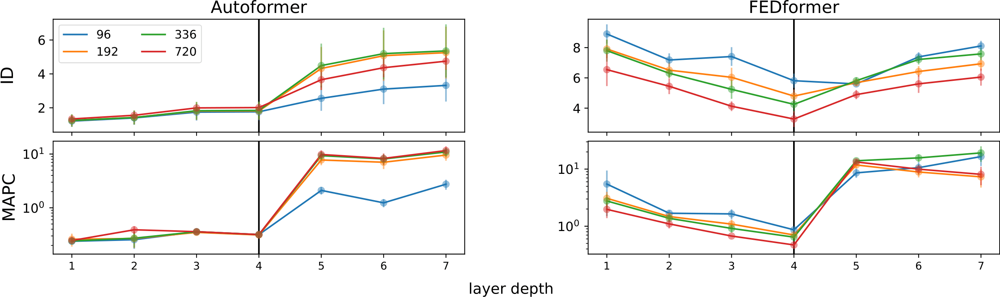
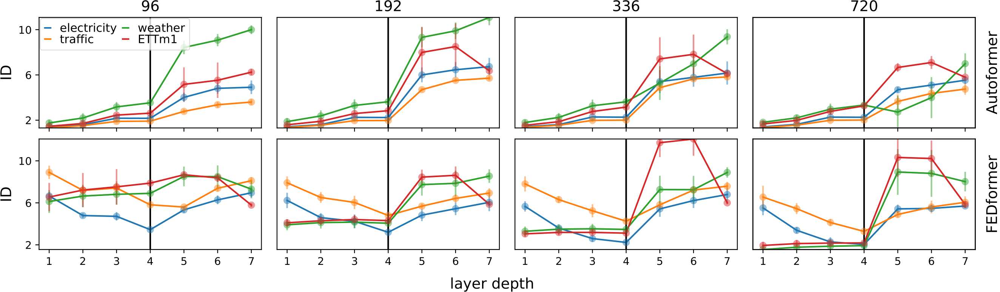
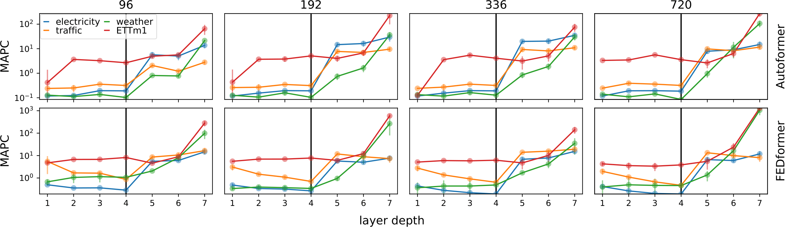
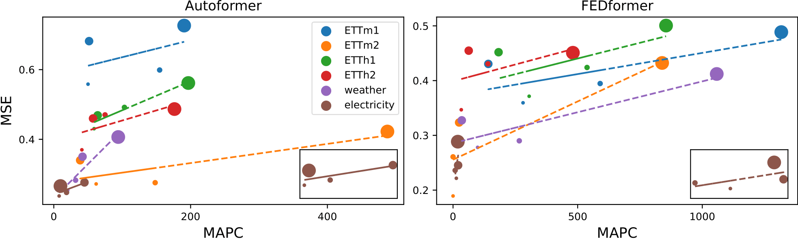
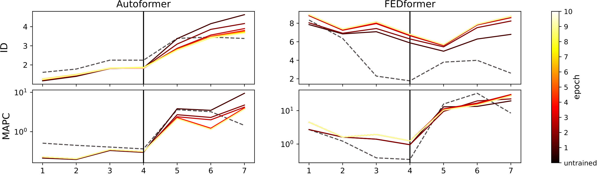

# GATLM
Geometric Analysis of Transformer Time Series Forecasting Latent Manifolds

## Our main results:
-Transformer forecasting manifolds exhibit two phases—dimensionality and curvature drop or remain fixed during encoding, then increase during decoding. 

<div align=center></div>

-This behavior is consistent across architectures and datasets.
<div align=center></div>
<div align=center></div>
-The MAPC estimate correlates with test mean squared error, enabling model comparison without the test set.
<div align=center></div>

-Geometric properties of the manifolds stabilize within a few training epochs.

<div align=center></div>
  
## Training

In the repository, you can find a training script for Autoformer and FEDformer on the following datasets: ETTm1, ETTh1, ETTm2, ETTh2, Electricity, Traffic and Weather.
To run the training process run the following command:
```
python train.py 
```
You can train all the models by running the following shell code separately:

```
bash ./scripts/run_M.sh
```

## Intrinsic Dimension and Curvature evaluation
To estimate the intrinsic dimension and curvature of the latent representations, execute the following command:
```
python est_curv.py --task_id ETTm1
```


## Paper
```
@misc{kaufman2024analyzingdeeptransformermodels,
      title={Analyzing Deep Transformer Models for Time Series Forecasting via Manifold Learning}, 
      author={Ilya Kaufman and Omri Azencot},
      year={2024},
      eprint={2410.13792},
      archivePrefix={arXiv},
      primaryClass={cs.LG},
      url={https://arxiv.org/abs/2410.13792}, 
}
```
